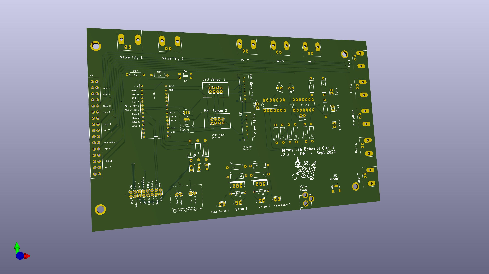

# HarveyBehaviorPCB v2
Circuit board for Harvey Lab VR behavior rigs

## Features
This board is designed to integrate a Teensy microcontroller and a National Instruemnts DAQ board (NI USB-600x) with the sensors and actuators on the behavior rig. Importantly, the board is used to convey the spherical treadmill movement signals to the VR computer. The Teensy makes a digital connection to the two ball movement sensors (mounted on the base of the spherical treadmill) to make continous reading of ball movement. It then produces three analog outputs, representing velocity in the _Yaw_, _Pitch_, and _Roll_ axes, that are read into the VR computer by the DAQ board. 

Other optional features of the PCB are: 
- Driver circuit for 2 solenoid valves (e.g. for liquid rewards)
- Two lick detector circuits
- A photodiode amplifier
- Many expansion ports/connectors: BNC connections, 0.1" headers, and a serial I2C connection (Qwiic connector)

## Fabrication
The full fabrication design is included in the [Gerber Zip File](PCB_v2_KiCAD/Gerbers/HarveyBehaviorPCB_v2.zip?raw=true). You can upload this file to any PCB fabrictor to get a quote and place an order. (The board does not have any special features, so the default settings for PCB manufacture are probably fine.) One a relatively low-cost option for a board this size is the $33/board (3 board minimum) special at [Advanced Circuits](https://www.advancedpcb.com/en-us/33-each-special/).

## Assembly
The [Bill of Materials](HarveyBehaviorPCB_v2_BOM.xlsx?raw=true) (BOM) file has the full list of components. Everything but the optional I2C connector is a through-hole part and can be soldered on with a simple soldering iron (and [proper technique](https://mightyohm.com/files/soldercomic/FullSolderComic_EN.pdf)). The board is divided up into labeled regions that decribe their high-level funtion and allow you to populate only the subset of components that you plan to use:
- **Valve driver circuit**, **Lick and photodide circuits**: These are optional functionalities. Only populate these regios if you plan to use them.
- **LP filters for volocity signals**: These are not optional. They low-pass filter the Teensy's digital (PWM) output to form a smooth analog signal for the NI board to aquire.
- **User 3/4 voltage-limiting circuit**: This is necessary if you plan to use the NI board's analog output pins (_AO-0_, _AO-1_) to control the voltage on _User-3_ and _User-4_. This circuit protects the Teensy from an accidental +5V output from the NI board (since the Teensy 4.0 cannot handle >3.3V inputs).
- **Jumpers JP2, JP3**: Optional. Short these jumpers (i.e., connect the pins within each jumper) to enable the NI analog output (_AO-0/1_, a.k.a. _User-3/4_) to control the valves.
- **Jumpers JP4, JP5**: Optional. In their default state they enable the I2C connector and disable the _MOT1_/_MOT2_ connections to the ball sensors. The _MOTx_ lines are not used during typical operation, so these jumpers are unlikely to be used.
