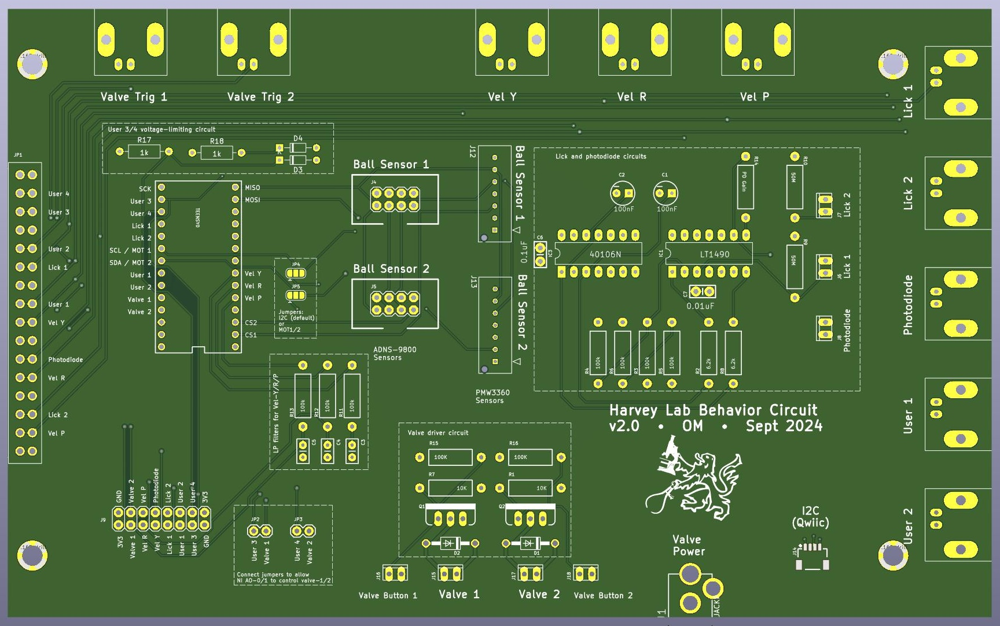

# HarveyBehaviorPCB v2
Circuit board for Harvey Lab VR behavior rigs

## Features
This board is designed to integrate a Teensy microcontroller and a National Instruemnts DAQ board (NI USB-600x) with the sensors and actuators on the behavior rig. Importantly, the board is used to convey the spherical treadmill movement signals to the VR computer. The Teensy makes a digital connection to the two ball movement sensors (mounted on the base of the spherical treadmill) to make continous reading of ball movement. It then produces three analog outputs, representing velocity in the _Yaw_, _Pitch_, and _Roll_ axes, that are read into the VR computer by the DAQ board. 

Other optional features of the PCB are: 
- Driver circuit for 2 solenoid valves (e.g. for liquid rewards)
- Two lick detector circuits
- A photodiode amplifier
- Many expansion ports/connectors: BNC connections, 0.1" headers, and a serial I2C connection (Qwiic connector)

## Fabrication
The full fabrication design is included in the [Gerber Zip File](https://github.com/HMS-RIC/HarveyBehaviorPCB/blob/master/PCB_v2_KiCAD/Gerbers/HarveyBehaviorPCB_v2.zip). You can upload this file to any PCB fabrictor to get a quote and place an order. (The board does not have any special features, so the default settings for PCB manufacture are probably fine.) One a relatively low-cost option for a board this size is the $33/board (3 board minimum) special at [Advanced Circuits](https://www.advancedpcb.com/en-us/33-each-special/).

## Assembly
